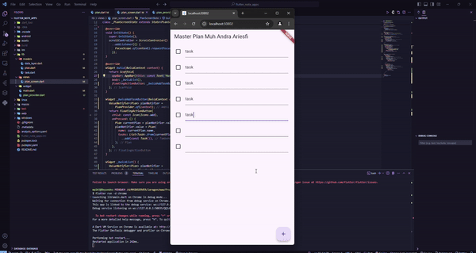
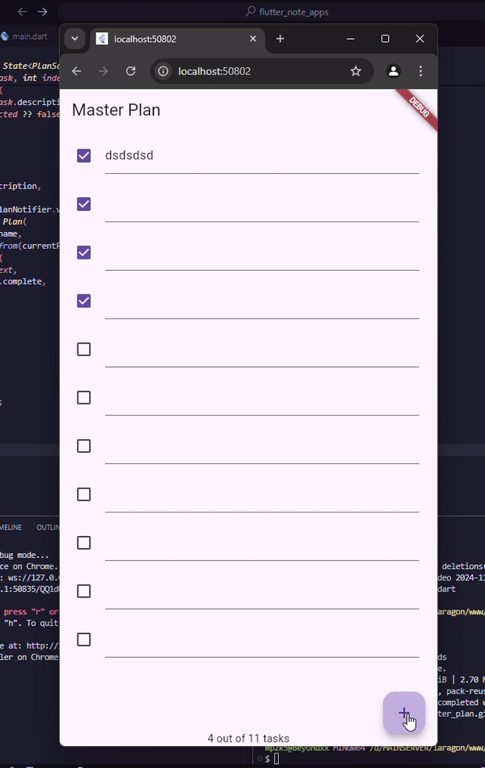

<a href="https://flutter.dev/">
  <h1 align="center">
    <picture>
      <source media="(prefers-color-scheme: dark)" srcset="https://storage.googleapis.com/cms-storage-bucket/6e19fee6b47b36ca613f.png">
      
    </picture>
  </h1>
</a>

[](https://flutter-dashboard.appspot.com/#/build?repo=flutter)
[](https://codecov.io/gh/flutter/flutter)
[](https://bestpractices.coreinfrastructure.org/projects/5631)
[](https://slsa.dev)

# NoteApps

A Flutter project Task Note Dev By Muh Andra Ariesfi.

## Getting Started

This project is a starting point for a Flutter application.

A few resources to get you started if this is your first Flutter project:

- [Lab: Write your first Flutter app](https://docs.flutter.dev/get-started/codelab)
- [Cookbook: Useful Flutter samples](https://docs.flutter.dev/cookbook)

For help getting started with Flutter development, view the
[online documentation](https://docs.flutter.dev/), which offers tutorials,
samples, guidance on mobile development, and a full API reference.

### To run on Android, be sure you have built the module first:

```bash
cd flutter_note_apps

flutter run id chrome
```
Run atau tekan F5 untuk melihat hasil aplikasi yang Anda telah buat. 
<div style="align-items: center; width: 1250px;">



</div>


.png)

#### Jelaskan maksud dari langkah 4 pada praktikum tersebut! Mengapa dilakukan demikian?

" File data_layer.dart berfungsi sebagai pintu masuk tunggal untuk mengakses semua model yang ada di dalam folder models. Hal ini membuat kode kamu menjadi lebih bersih, terorganisir, dan mudah dipelihara. "

#### Mengapa perlu variabel plan di langkah 6 pada praktikum tersebut? Mengapa dibuat konstanta ?

#### Apa kegunaan method pada Langkah 11 dan 13 dalam lifecyle state ?

" Apa itu initState()?

    Inisialisasi Awal: Metode ini dipanggil saat pertama kali sebuah widget dimasukkan ke dalam widget tree.
    Satu Kali Eksekusi: Metode ini hanya berjalan sekali selama siklus hidup widget.
    Tujuan:
        Menginisialisasi variabel-variabel yang akan digunakan di dalam state.
        Memulai animasi, timer, atau subscription.
        Melakukan operasi yang hanya perlu dilakukan satu kali saat widget pertama kali ditampilkan.

Contoh Penggunaan dalam Langkah 11:

    Membuat ScrollController: Di sini, scrollController dibuat untuk mengontrol scroll behavior dari suatu ListView atau ScrollView.
    Menambahkan Listener: Dengan addListener, kita menambahkan sebuah listener yang akan dipanggil setiap kali posisi scroll berubah.
    Mengatur Fokus: Ketika scroll berubah, fokus akan dipindahkan ke sebuah FocusNode yang kosong. Ini sering digunakan untuk menyembunyikan keyboard saat pengguna mengscroll.

Ringkasnya, initState digunakan untuk menyiapkan semua hal yang dibutuhkan oleh widget sebelum ditampilkan pertama kali.
dispose()

Apa itu dispose()?

    Pembersihan: Metode ini dipanggil saat widget akan dihapus dari widget tree.
    Satu Kali Eksekusi: Metode ini hanya berjalan sekali sebelum widget benar-benar dihapus.
    Tujuan:
        Membersihkan sumber daya yang sudah tidak digunakan lagi, seperti timer, subscription, atau animasi.
        Menghentikan proses yang sedang berjalan.
        Membatalkan listener yang telah ditambahkan sebelumnya.

Contoh Penggunaan dalam Langkah 13:

    Membuang ScrollController: Dengan memanggil scrollController.dispose(), kita membuang scrollController dan semua listener yang terkait dengannya. Ini penting untuk menghindari memory leak.

Ringkasnya, dispose digunakan untuk membersihkan semua resource yang telah digunakan oleh widget agar tidak menyebabkan masalah pada aplikasi.
Kenapa Penting?

    Mencegah Memory Leak: Jika kita tidak membuang resource yang sudah tidak digunakan, aplikasi kita bisa mengalami memory leak dan lambat laun menjadi tidak responsif.
    Meningkatkan Performa: Dengan membersihkan resource yang tidak diperlukan, kita dapat meningkatkan performa aplikasi.
    Memastikan Keamanan: Membuang resource yang sensitif (seperti subscription ke layanan eksternal) dapat meningkatkan keamanan aplikasi.

Kesimpulan

initState dan dispose adalah dua metode yang sangat penting dalam lifecycle stateful widget di Flutter. Dengan memahami fungsi dari kedua metode ini, kita dapat menulis kode yang lebih efisien, aman, dan terkelola dengan baik. "


<div style="align-items: center;">



</div>

#### PRAKTIKUM #2
#### Jelaskan mana yang dimaksud InheritedWidget pada langkah 1 tersebut! Mengapa yang digunakan InheritedNotifier?
" InheritedWidget pada langkah 1 merujuk pada sebuah widget yang digunakan untuk membagikan data secara efisien ke seluruh subtree di bawahnya. Dalam kasus ini, InheritedNotifier dipilih karena memungkinkan data yang dibagikan dapat berubah-ubah dan notifikasi akan dikirim ke subtree saat terjadi perubahan. Hal ini sangat berguna untuk mengelola state yang bersifat global atau yang ingin diakses oleh banyak widget. "

#### Jelaskan maksud dari method di langkah 3 pada praktikum tersebut! Mengapa dilakukan demikian?
" Metode completedCount dan completenessMessage pada model Plan berfungsi untuk menghitung jumlah tugas yang telah selesai dan memberikan informasi persentase penyelesaian secara ringkas. Mengapa hal ini dilakukan? Dengan adanya dua metode ini, kita dapat dengan mudah mendapatkan informasi mengenai progres penyelesaian suatu rencana tanpa perlu melakukan perhitungan yang rumit di setiap bagian kode yang membutuhkan data tersebut. Informasi ini sangat berguna untuk ditampilkan dalam tampilan aplikasi, misalnya dalam bentuk progress bar atau teks deskriptif. "

